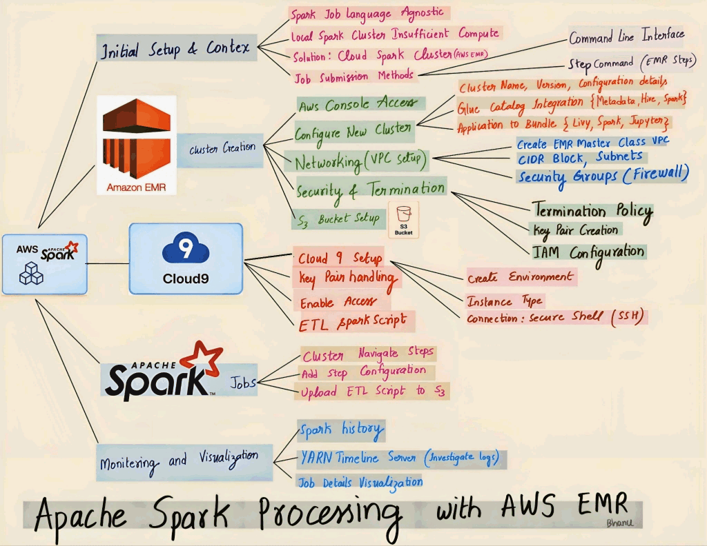

# Apache Spark Processing with AWS EMR

## 📘 Overview

This project demonstrates how to handle **large-scale data processing**
using **Apache Spark** on **AWS Elastic MapReduce (EMR)**.\
It walks through the complete workflow --- from setting up
infrastructure to automating Spark jobs in the cloud.




This project is designed for data engineers, analysts, and ML
practitioners who want to scale data pipelines beyond local
environments.

------------------------------------------------------------------------

## 🎯 Objective

To process large datasets efficiently using a **distributed computing
framework (Apache Spark)** deployed on a **managed cluster (AWS EMR)**,
connected to **S3** for data storage and **Glue** for metadata
management.

------------------------------------------------------------------------

## 🧱 Architecture Overview

                 ┌───────────────────────────┐
                 │     AWS Cloud Platform    │
                 └───────────────────────────┘
                             │
              ┌──────────────┴──────────────┐
              │                             │
       ┌─────────────┐              ┌────────────────┐
       │ Amazon S3   │              │ AWS Glue Data  │
       │ (Storage)   │              │ Catalog        │
       └─────────────┘              └────────────────┘
              │                             │
              └──────────┬──────────────────┘
                         │
                 ┌──────────────────────────────┐
                 │ AWS Elastic MapReduce (EMR)  │
                 │ ─ Spark                      │
                 │ ─ Livy                       │
                 │ ─ JupyterHub                 │
                 │ ─ YARN / Hadoop              │
                 └──────────────────────────────┘
                         │
              ┌──────────┴──────────┐
              │                     │
       ┌─────────────┐       ┌──────────────┐
       │ Cloud9 IDE  │       │ EMR Steps    │
       │ (SSH Access)│       │ (Automation) │
       └─────────────┘       └──────────────┘

------------------------------------------------------------------------

## ⚙️ Technologies & AWS Services Used

  -----------------------------------------------------------------------
  Category              Tool/Service                  Purpose
  --------------------- ----------------------------- -------------------
  Compute               **Apache Spark (PySpark)**    Distributed
                                                      processing engine

  Cluster Management    **AWS EMR (Elastic            Managed
                        MapReduce)**                  Hadoop/Spark
                                                      cluster

  Storage               **Amazon S3**                 Data lake for
                                                      input/output

  Metadata              **AWS Glue Data Catalog**     Centralized schema
                                                      and table metadata

  IDE                   **AWS Cloud9**                Cloud-based IDE for
                                                      development and SSH

  Networking            **VPC, Subnets, NAT, S3       Private, secure
                        Gateway**                     network
                                                      configuration

  Security              **IAM Roles & Instance        Role-based access
                        Profiles**                    for EMR & EC2

  Security              **Key Pair (.pem)**           SSH access

  Firewall              **Security Groups**           Define
                                                      inbound/outbound
                                                      rules

  Monitoring            **YARN / Spark History        Track resource
                        Server**                      utilization & job
                                                      performance

  Interface             **Livy / JupyterHub**         Remote Spark API &
                                                      notebook interface

  Automation            **EMR Steps**                 Run repeatable
                                                      Spark jobs
  -----------------------------------------------------------------------

------------------------------------------------------------------------

## 🧩 Project Workflow

### 1️⃣ Infrastructure Setup

-   Created **VPC** with custom subnets and gateways.\
-   Configured **Security Groups** to allow SSH and Jupyter access.\
-   Generated **Key Pair** for secure connections.\
-   Defined **IAM Roles** for EMR service and EC2 instance profile with
    S3 access.

### 2️⃣ Data Storage

-   Created an **Amazon S3 bucket** for storing input and output data.\
    Example: `s3://emr-masterclass-codewithyu/`\
-   Uploaded large CSV datasets (e.g., NYC Taxi Trips).

### 3️⃣ Cluster Deployment

-   Launched an **EMR Cluster (v6.14)** with:
    -   Spark\
    -   Livy\
    -   Hadoop\
    -   JupyterHub\
    -   AWS Glue integration\
-   Configured EC2 instance types and EBS volume size (default 15GB).

### 4️⃣ Cloud9 Environment

-   Created an **AWS Cloud9** environment for development.\

-   Uploaded the PEM key to Cloud9 and set permissions using:

    ``` bash
    chmod 400 emr-masterclass-key.pem
    ```

-   Connected securely to the EMR master node using SSH.

### 5️⃣ Spark ETL Script (`spark_etl.py`)

``` python
from pyspark.sql import SparkSession
from pyspark.sql.functions import current_timestamp

spark = SparkSession.builder.appName("Spark_ETL").getOrCreate()

input_path = "s3://emr-masterclass-codewithyu/input/nyc_taxi.csv"
output_path = "s3://emr-masterclass-codewithyu/output/processed_data"

df = spark.read.csv(input_path, header=True, inferSchema=True)
df = df.withColumn("processing_time", current_timestamp())

df.write.mode("overwrite").parquet(output_path)

spark.stop()
```

### 6️⃣ Running Spark Jobs

**Option 1 -- Interactive Run (via SSH)**

``` bash
spark-submit spark_etl.py s3://.../input s3://.../output
```

**Option 2 -- Automated Run (via EMR Steps)**\
- Added a new EMR Step in AWS Console.\
- Selected **Command Runner** and entered the spark-submit command.\
- Configured output path to prevent overwrites.

### 7️⃣ Monitoring

-   Tracked job performance using:
    -   **Spark History Server** → DAG visualization, task execution.\
    -   **YARN Timeline Server** → Resource utilization.

------------------------------------------------------------------------

## 🧠 Key Learnings

1.  **IAM Permissions are critical** → EC2 instance profile must have S3
    access.\
2.  **EMR Scaling** → Start small, scale when stable.\
3.  **Spark Optimization** → DAG visualization helps identify
    performance bottlenecks.\
4.  **Glue + S3 Integration** → Simplifies schema discovery and metadata
    handling.\
5.  **Automation with EMR Steps** → Reduces manual execution overhead.

------------------------------------------------------------------------

## 📈 Results

-   Successfully processed **\~20,000+ records** using PySpark.\
-   Automated pipeline runs reproducibly with minimal manual
    intervention.\
-   Achieved cost efficiency by shutting down the cluster after
    processing.

------------------------------------------------------------------------

## 🧰 Future Enhancements

-   Integrate **AWS Step Functions** for full workflow orchestration.\
-   Add **Spark Structured Streaming** for real-time data ingestion.\
-   Use **Athena/Redshift Spectrum** for query analytics on processed
    data.

------------------------------------------------------------------------

## 👨‍💻 Author

**Bhanu Teja Giddaluru**\
Data & AI Engineer \| AWS \| Apache Spark \| GenAI \| ML\
[LinkedIn](https://www.linkedin.com) \| [GitHub](https://github.com)

------------------------------------------------------------------------

### 📄 License

This project is open-sourced under the MIT License.
